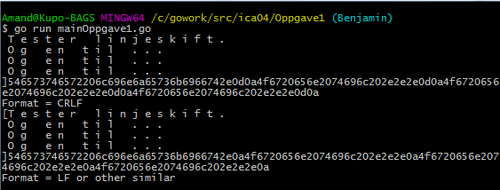

# Oppgave 1

a)
Vi har lest begge filene vha. fileutils og fant ut at filene er ganske like med noen forskjell i koden.
I koden har vi lagt til en printf metode som formaterer teksten til heksadesimale tegn og string.
Slik kan vi finne ut at text1.txt filen inneholder flere heksadesimal tegn enn text2.txt filen. Ved hjelp av fmt.Prtintf(%x) funksjonen, ser vi at det ligger fler heksadesimale tegn i  text1.txt enn text2.txt filen.

Formateringen ser slik ut:
Tekst 1 er øverst.

Vi kan se at i text1.txt filen ligger det heksadesimale tegn som vi ikke kan finne I text2.txt filen. Forskjellen ligger der vi kan lese 0d0a i fil nr. 1, mens fil nr.2 har bare 0a.

0A = line feed
0D = carriage return

Det vil si at i text1.txt filen har vi både line feed og carriage return. I text2.txt filen derimot har vi kun line feed.

CR og LF er kontrolltegn, henholdsvis kodet 0x0D (13 desimal) og 0x0A (10 desimal). De brukes til å markere et linjeskift i en tekstfil.
Som angitt, bruker Windows to tegn CR LF sekvens; Unix bruker bare LF og den gamle MacOS (pre-OSX MacIntosh) brukte CR.
