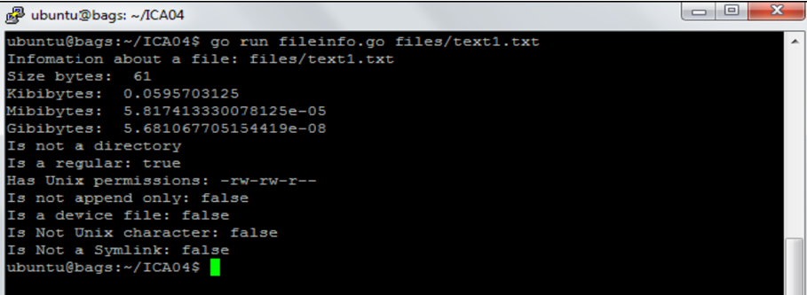

# Oppgave 2

I denne koden har vi brukt «main package».

Packages:

I denne «main package» finner vi disse importerte pakkene: fmt, log og os.

fmt: En pakke som følger med i distribusjonen av Go, og brukes til å skrive til konsollen.

log: Implementerer en måte for å logge informasjon. I koden blir den brukt for å logge feilmeldinger.

os: Gir et uavhengig plattformgrensesnitt for å ta i bruk system operasjoner.

a)

Vi har lagd et Golang program som heter fileinfo.go som kan utføres fra kommandolinje. Programmet tar inn et argument som er et filnavn. Stien til filnavnet er enten relativ eller absolutt.

Kommandoen for å utføre programmet se slik ut:
Fileinfo -f <filnavn>

Programmet returnere detaljert informasjon om en fil med <filnavn>. For eksempel ut-data for kommandoen:

fileinfo.go "filnavn" (filnavn som du ønsker å skanne)

Resultat skal være:

1. Information about a file <filnavn_med_full_sti>:
2. Size: X in bytes, kibibytes, mibibytes og gibibytes
3. Is/Is not a directory
4. Is/Is not a regular file
5. Has Unix permission bits: -rwxrwxrwx
6. Is/Is not a append only
7. Is/Is not a device file
8. Is/Is not Unix character device
9. Is/Is not a Unix block device
10. Is/Is not a symbolic link

Resultat som ble utført i skyinstansen om informasjon til fil "text1.txt" er:

b)

For å kunne kjøre filene må man skrive «go run fileinfo.go /dev/stdin» og «go run fileinfo.go /dev/ram0». Resultatet som programmet returnerer for filene i et Linux-miljø (i skyinstansen).

/dev /stdin:

/dev/ram0:

Vi prøve å kjøre /dev/ram0 , men fikk det ikke til. Vi har prøvd å sette inn «Lstat» metode, men fikk dnne meldingen i stedet for.

c)

Test programmet på 3 plattformene.

Test av text1.txt på MS Windows:

Test av text1.txt på Mac OS X:

Test av text1.txt på Linux (skyinstansen):

Resultat med å teste «text1.txt» fant vi ingen forskjeller mellom Linux(skyinstansen) og Mac OS X operativsystemer, men med MS Windows operativsystemer ser ut at MS Windows bruker mer bytes til å kjøre text1.txt filen.  
