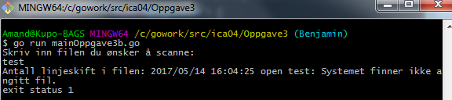
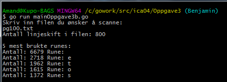

# Oppgave 3

a)
Pakker
Golang har flere pakker for å håndtere filer.
Os pakken har en del grunnleggende funksjoner for å
arbeide med filene. Io, ioutil og bufio pakkene har
ekstra funksjoner. Et eksempel er ioutil.WriteFile
som lager/åpner, skriver i og lukker en fil. Ved bruk
av os pakken må man bruke flere funksjoner som OpenFile,
Write og Close. Ioutil pakken gjør koden mindre og kjappere
å skrive.

Generelle Operasjoner
I golang har man flere funksjoner som brukes for å
arbeide med filer. Flere grunnleggende som å lage en
fil og slette den, gi nytt navn og flytte den, og åpne
og lukke den. Det er også funksjoner for informasjon
relatert til filen.

Write
Golang har funksjoner som skriver til filer. Det vil si
at et program kan endre dataen i en fil. Os.Write er en
funksjon som skriver til en fil. Generelt blir write brukt
som et uttrykk for å endre på en fil.
Hvis du bytter navn eller flytter en fil sier man at man
skriver filen til mappen.

Read
Likt skriving, golang kan også lese filer. Programmet
leser dataen i filen og gir resultatet som var spesifisert.
Ulikt skriving er det funksjoner i bufio pakken som ikke er
tilgjengelige i os.File eller io.Reader.

Buffering
Det er også mulig å skrive og lese med en buffer; programmet
håndterer data i minnet. Når du skriver med en buffer, skriver
du til filen i slices i stedet for byte til byte. Du kan for
eksempel skrive et vsist antall bytes i minne, før du bestemmer
å skrive til disk. Lesing bruker samme logikk. Du leser et
visst antall bytes i puljer.

Arkivere og Komprimere
Golang har også muligheten til å arkivere og komprimere
filer ved bruk av archive/zip og compress/gzip pakkene.

b)
DifferentReadWrite mappen inneholder tre programmer som leser på forskjellig måte og et program som leser. Alle programmene bruker «leking.txt».

// Dette er ikke vår kode, kode tatt ifra:
// https://github.com/Zwirc/IS-105/blob/master/ICA04/src/oppgaver/oppgave3.go

Pakker
Bufio: Implementerer bufret I/O. Tar i bruk io.Reader og io.Writer for å lage et nytt objekt som også tar i bruk grensesnittet, men gir buffering og hjelp for tekstlig I/O.
Bytes: Implementerer funksjoner for å manipulere «byte slices».
Fmt: Implementerer funksjoner for å formatere I/O ved hjelp av utskrifts verb.
Log: Implementerer en måte for å logge informasjon. I koden blir den brukt for å logge feilmeldinger.
Os: Gir et uavhengig plattformgrensesnitt for å ta i bruk system operasjoner.
Sort: Blir brukt for å sortere «slices» og samlinger.

Fil som skal bli lest: pg100.txt

Linje 17 – 34, func Oppgave3b()
Funksjonen blir brukt for å gjøre oppgave 3b; telle antall linjeskift og finne de 5 mest brukte runene. Det første den gjør er å skrive ut en beskjed til brukeren som spør om navnet til en fil som skal bli brukt. Hvis den ikke finner en fil skriver den ut en feil melding når den prøver å åpne filen.

Hvis du gir terminalen riktig input kjører den programmet:

Når du skriver inn en fil som eksisterer blir den pekt mot en string. En skanner går over stringen og legger til teksten fra filen til stringen. Når den er ferdig med å kopiere teksten bryter den for løkken og fortsetter med videre kall.

Funksjoner kaller så på funksjonen «findInText» etter den skriver ut en melding. Funksjonen blir brukt for å lete etter linjebrudd i teksten, for så å skrive ut resultatet.

Så bruker den funksjonen «countFile». Den lager et «map» som bruker tidligere angitt fil.

Til slutt blir den siste funksjonen kalt: «sortAndPrint» som buker et map som ble lagd i countFile funksjonen.

Linje 38 – 53, func findInText(filename string, find string) int
Funksjonen tar in to string argumenter. Det første argumentet blir brukt for å åpne filen som skal bli lest (stringen peker mot filen pga bruk av os.Stdin). Det andre argumentet blir brukt for å søke etter «elementet» du er ute etter. Til slutt returnerer den en int verdi; hvor mange ganger den har telt det andre argumentet.

Funksjonen prøver først å åpne filen, og gir en feilmelding hvis det skjer en feil. Deretter setter den opp en stor buffer som blir brukt for å lese filen. En int variabel navngitt «count» blir brukt for å returnere int verdien. Search variabelen gjør string om til []byte for å søke gjennom den.

Til slutt blir bufferen lest og for hver gang den finner elementet du leter etter legger den til 1 i count. Når bufferen er utlest, blir int verdien returner.

Linje 57 – 66, countFile(filename string) map[int]string
Igjen bruker funksjonen et argument for å peke mot filen som skal bli lest. Denne funksjonen returnerer et map.

Først lager funksjonen et map som bruker int som nøkkel og string som verdi. Så går den gjennom en for løkke for hvert eneste ascii tegn. Hvert ascii tegn skal gå gjennom teksten i filen for å telle antall ganger det er brukt. findInText funksjonen blir brukt for å klare dette. Det siste som skjer i hver løkke er at en nøkkel (count) blir angitt en verdi (rune).

Til slutt blir mappet returnert.

Linje 71 – 90, func sortAndPrint(m map[int]string)
Funksjonen bruker kartet som ble lagd tidligere som argument. Variabel «keys» av type []int blir satt opp. En for løkke itererer over m (map). Nøklene blir satt inn i int listen og hver verdi for en string tilføyd (en spesial regel gir lov til at en string kan bli tilføyd i en liste av forskjellig type). Nå er det lagd en liste som har antall ganger telt (int) og hvilket element som er blitt telt (rune).

Listen blir sortert ifra høyest til lavest int verdi, for så å blir skrevet ut til terminalen.
